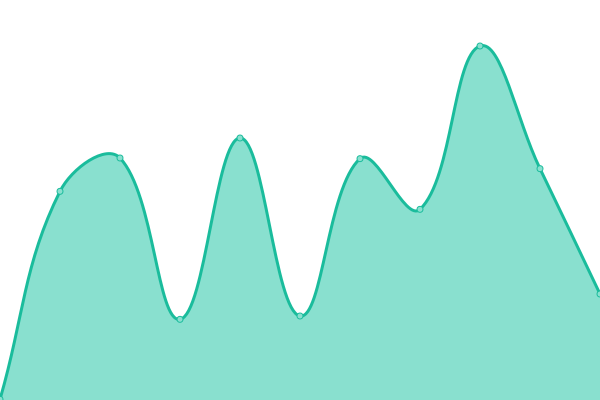
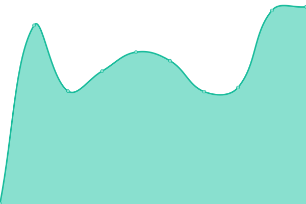
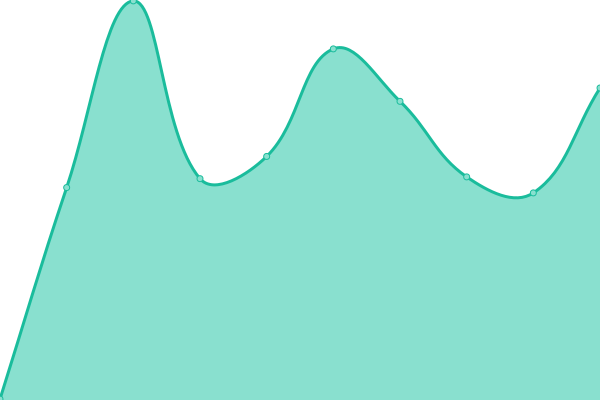
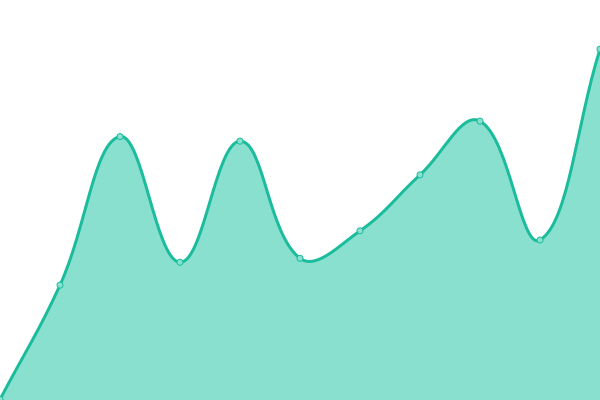
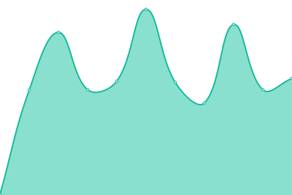

# [Status](https://status.koj.co): <!--live status--> **🟩 All systems operational**

This repository contains the open-source uptime monitor and status page for Koj, powered by [Upptime](https://upptime.js.org).

With [Upptime](https://upptime.js.org), you can get your own unlimited and free uptime monitor and status page, powered entirely by a GitHub repository. We use [Issues](https://github.com/koj-co/status/issues) as incident reports, [Actions](https://github.com/koj-co/status/actions) as uptime monitors, and [Pages](https://status.koj.co) for the status page.

[**Visit our status website →**](https://status.koj.co)

<!--start: status pages-->

| URL                                                                       | Status | History                                                                                        | Response Time                                                                      | Uptime                                                                                                                                                        |
| ------------------------------------------------------------------------- | ------ | ---------------------------------------------------------------------------------------------- | ---------------------------------------------------------------------------------- | ------------------------------------------------------------------------------------------------------------------------------------------------------------- |
| [Koj.co](https://koj.co/en-ch/)                                           | 🟩 Up  | [koj-co.yml](https://github.com/koj-co/status/commits/master/history/koj-co.yml)               |  560ms        |         |
| [Koj Analytics](https://analytics.koj.co)                                 | 🟩 Up  | [koj-analytics.yml](https://github.com/koj-co/status/commits/master/history/koj-analytics.yml) |  317ms |  |
| [Koj API](https://api.koj.co)                                             | 🟩 Up  | [koj-api.yml](https://github.com/koj-co/status/commits/master/history/koj-api.yml)             |  311ms       |        |
| [Go.Koj](https://go.koj.co/url-shortener-uptime-monitoring-24hu9q0ir1290) | 🟩 Up  | [go-koj.yml](https://github.com/koj-co/status/commits/master/history/go-koj.yml)               |  661ms        |         |
| [Koj CDN](https://kojcdn.com)                                             | 🟩 Up  | [koj-cdn.yml](https://github.com/koj-co/status/commits/master/history/koj-cdn.yml)             |  335ms       |        |

<!--end: status pages-->

## 📄 License

- Code: [MIT](./LICENSE) © [Koj](https://koj.co)
- Data in the `./history` directory: [Open Database License](https://opendatacommons.org/licenses/odbl/1-0/)

  

  An open source project by <a href="https://koj.co">Koj</a>.   <a href="https://koj.co">Furnish your home in style, for as low as CHF175/month →</a>

