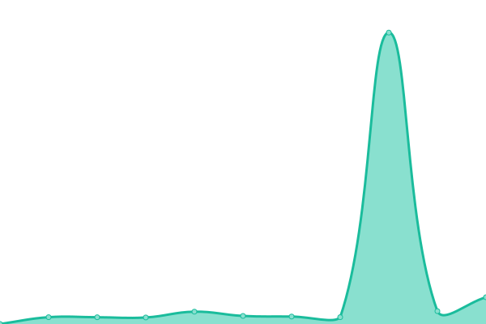
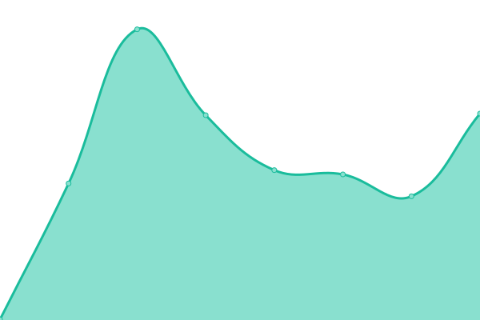
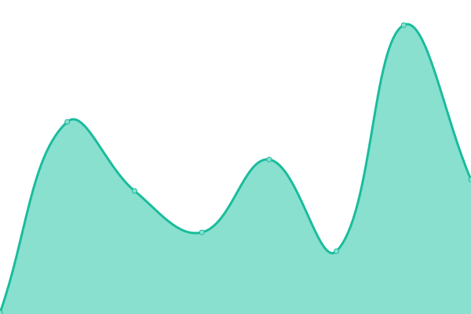
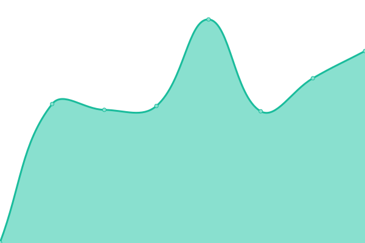

# [Status](https://status.koj.co): <!--live status--> **🟧 Partial outage**

This repository contains the open-source uptime monitor and status page for Koj, powered by [Upptime](https://upptime.js.org).

With [Upptime](https://upptime.js.org), you can get your own unlimited and free uptime monitor and status page, powered entirely by a GitHub repository. We use [Issues](https://github.com/koj-co/status/issues) as incident reports, [Actions](https://github.com/koj-co/status/actions) as uptime monitors, and [Pages](https://status.koj.co) for the status page.

[**Visit our status website →**](https://status.koj.co)

<!--start: status pages-->
<!-- This summary is generated by Upptime (https://github.com/upptime/upptime) -->
<!-- Do not edit this manually, your changes will be overwritten -->
<!-- prettier-ignore -->
| URL | Status | History | Response Time | Uptime |
| --- | ------ | ------- | ------------- | ------ |
|  [Koj.co](https://koj.co/en-ch/) | 🟩 Up | [koj-co.yml](https://github.com/koj-co/status/commits/HEAD/history/koj-co.yml) | 

 307ms
     
 | 

<a href="https://status.koj.co/history/koj-co">100.00%</a>
    

|  [Koj Analytics](https://analytics.koj.co) | 🟥 Down | [koj-analytics.yml](https://github.com/koj-co/status/commits/HEAD/history/koj-analytics.yml) | 

 2135ms
     
 | 

<a href="https://status.koj.co/history/koj-analytics">99.84%</a>
    

|  [Koj API](https://api.koj.co) | 🟩 Up | [koj-api.yml](https://github.com/koj-co/status/commits/HEAD/history/koj-api.yml) | 

 326ms
     
 | 

<a href="https://status.koj.co/history/koj-api">100.00%</a>
    

|  [Go.Koj](https://go.koj.co/url-shortener-uptime-monitoring-24hu9q0ir1290) | 🟩 Up | [go-koj.yml](https://github.com/koj-co/status/commits/HEAD/history/go-koj.yml) | 

 372ms
     
 | 

<a href="https://status.koj.co/history/go-koj">100.00%</a>
    

|  [Koj CDN](https://kojcdn.com) | 🟩 Up | [koj-cdn.yml](https://github.com/koj-co/status/commits/HEAD/history/koj-cdn.yml) | 

 288ms
     
 | 

<a href="https://status.koj.co/history/koj-cdn">100.00%</a>
    

<!--end: status pages-->

## 📄 License

- Powered by: [Upptime](https://github.com/upptime/upptime)
- Code: [MIT](./LICENSE) © [Koj](https://koj.co/engineering)
- Data in the `./history` directory: [Open Database License](https://opendatacommons.org/licenses/odbl/1-0/)

  

  An open source project by <a href="https://koj.co">Koj</a>.   <a href="https://koj.co">Furnish your home in style, for as low as CHF175/month →</a>

